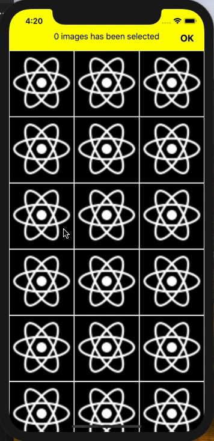

# Image Chooser

Một component React-native sử dụng để hiển thị danh sách ảnh và cho phép chọn từng ảnh.

### Thư viện sử dụng

Trong project có sử dụng 

* [react-native-vector-icons](https://github.com/oblador/react-native-vector-icons) - Thư viện sử dụng font icon

### Cài đặt

Chạy lệnh

```
npm install
```

Sau đó

```
react-native link react-native-vector-icons
```

Nếu link lỗi thì làm theo cách thủ công trong hướng dẫn của thư viện

## DEMO

[](https://gyazo.com/2129f5af2b94e911f280b2d2e67b0e0d)

## Hướng dẫn sử dụng

```
<ImageChooser 
    data={/* list image url */}
    column={/* column number */}
    icon={/* font awesome icon name */}
    onSelect={/* when choose 1 item */}
    onRelease={/* when click OK */}
/>
```